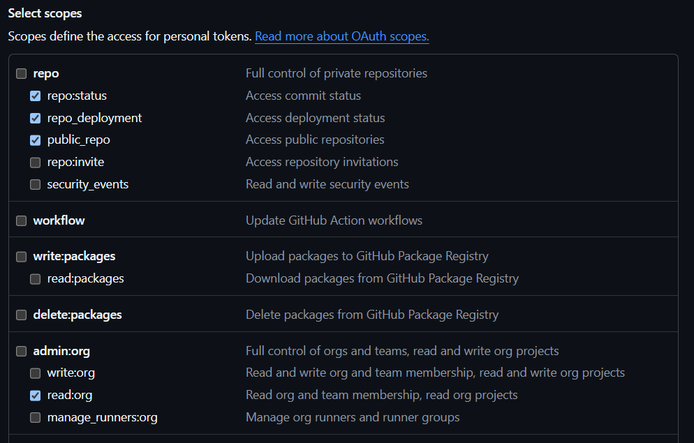
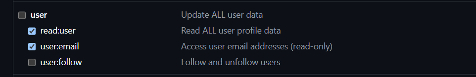
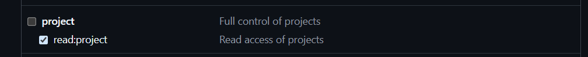
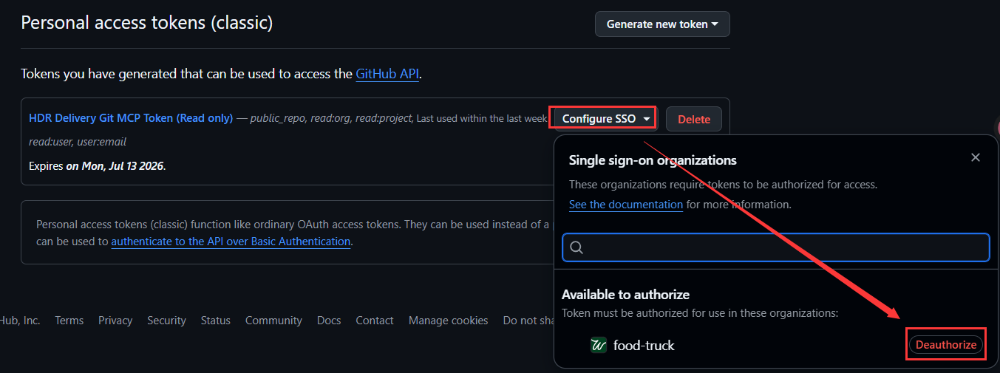

# 写在最前

> Hi，我们是本届 CT Hackathon 的 **Team Aback**。感谢队友 **Mantee** 和 **Jason** 的付出，恭喜我们顺利完赛。
>
> **特别鸣谢**
> - **Jay** — 感谢 Jay 的 [Knowlery 插件](https://jayjiangct.github.io/knowlery/zh/) 在项目早期阶段的探索与启发
> - **Dobby** — 我们的荣誉队长，真的很好 Rua
>
> **重要**：使用 dm-seek Demo 前，请务必将 Claude Code 模型配置修改为 **DeepSeek**，并确保已执行 `/logout`。Agent Team **真的很贵**。
> 如果你还没有DeepSeek API Key，请联系**Jakob**。
>
> 本 Demo 未经深度优化，还存在许多问题，欢迎你提供反馈帮助我们改进。
>
> — *Dylan*


---

# dm-seek（马冬梅计划）产品介绍

> **面向研发全角色的「代码现实 × 需求演进」智能追溯系统**
>
> 当你想知道"这段代码为什么这么写"、"这个功能是什么时候改的"、"那个 Bug 的根源是什么"——dm-seek 用一句话回答你的疑问，并为每个结论附上出处证据。
>
> 更多信息请访问 [GitHub Repo](https://github.com/2026hackathon/dm-seek)。

---

## 目录

1. [产品概述](#1-产品概述)
2. [服务人群](#2-服务人群)
3. [应用场景](#3-应用场景)
4. [团队角色与协作](#4-团队角色与协作)
5. [工作流程](#5-工作流程)
6. [依赖组件](#6-依赖组件)
7. [输出产物](#7-输出产物)
8. [初始化方式](#8-初始化方式)
9. [安全与边界](#9-安全与边界)

---

## 1. 产品概述

### 1.1 解决什么问题

一个功能的完整认知天然分散在四个互相割裂的信息孤岛中：

| 信息源 | 回答的问题 | 现状 |
|--------|-----------|------|
| **代码库** | 它现在「是什么样」 | 只有开发能读懂 |
| **Git 历史** | 它「怎么一步步变成今天这样」 | 散落在 commit log 里 |
| **Jira** | 每次变更「为什么发生」 | 淹没在工单海洋中 |
| **Figma**（二期） | 当初的「设计意图」 | 与实现脱节 |

当任何一方与"某人的记忆"产生认知偏差时，就会引发**沟通摩擦、决策失误、责任争议**。现实中没有一个统一入口能把四源串起来回答"这个功能现在是什么样、怎么变成这样、为什么变"。

### 1.2 核心能力

dm-seek 是一个由 **7 个 AI Agent 组成的智能团队**，以 **Claude Code 为运行引擎**，串起代码、Git 历史、Jira 工单三大信息源。你输入一句自然语言疑问，全自动完成：

```
知识库线索 → 代码定位解读 → Git 时间线 + 工单号抽取 → Jira 业务原因 → 综合结论 → 证据校验
```

Agent 间采用 **P2P 链式直传** 通信，dongmei-ma 只监控进度不持全量数据。支持 **depth 条件跳步**（shallow ~1min / normal ~2min / deep ~3min），简单问题不跑全链路。

最终交付一份**有出处、带置信度的功能演变报告**——每个结论都挂着具体的代码行、commit hash、Jira 工单号。

### 1.3 核心设计原则

- **以代码为唯一事实基准**：一切结论必须能回挂到具体的代码 / commit / Jira 出处；当"代码现实"与"记忆/文档"冲突时，以代码为锚
- **所有操作只读**：代码、Git 仓库、Jira 均只读取，不修改（仅 `git fetch` 和知识库写作为例外）
- **知识自增长**：每次查询的结论自动沉淀回知识库，同类问题下次秒答
- **证据不足则发散返工**：不臆造结论，最多 2 轮扩大搜索；仍不足则降级交付并显式声明"证据不足"

### 1.4 输出报告样例

- dm-seek 默认使用 CLI 输出结论。在分析完成后，你可以要求他生成一份 HTML 报告
- [HTML 输出报告样例](reports/HDR-BA-allocationSetting-排查报告.html)
- [运行全流程详情](reports/dm-seek-全流程总结.html)
- [更多报告样例](https://github.com/2026hackathon/dm-seek/tree/main/reports)

---

## 2. 服务人群

dm-seek 面向**研发全角色**——不只是开发者，还包括产品、测试、架构等所有需要理解"代码现实"的人。

| 角色 | 典型痛点 | dm-seek 提供 |
|------|---------|-------------|
| **开发者** | 调试时不知这段逻辑为什么写成这样；接手遗留代码无文档 | Git → Commit → Jira 自动还原决策链 |
| **测试工程师** | 发现 Bug 但不确定是"实现偏差"还是"需求变更未同步" | 代码 vs Jira 原始需求对比 |
| **产品经理** | 想知道某个功能的设计决策历程，但不会翻代码 | 自然语言提问，executiveSummary 用业务语言回答 |
| **开发者/产品经理** | 评估跨团队接口变更的影响范围 | 调用链追踪 + 跨仓库变更分析 |
| **新成员** | 入职不知从何看起，问资深开发有时差/负担 | 一句自然语言，分钟级上手模块知识 |

### 2.1 两种使用模式

dm-seek 支持两类用户的不同场景：

| 模式 | 适用人群 | 数据来源 |
|------|---------|---------|
| **态 A（远端仓库）** | PM、测试、非研发用户（无本地仓库） | 全程经 GitHub MCP 获取代码与提交历史 |
| **态 B（本地仓库）** | 开发者（有本地 Git 仓库） | 直读本地代码 + 本地 Git 历史，过时时可切换远端 |

---

## 3. 应用场景

> 首批已识别 9 大场景（场景 9 含 Figma 设计追溯，属二期能力）。场景清单可扩展，不视为封闭集合。

### 场景一览

| # | 场景 | 典型问题 | 主要受益角色 |
|---|------|---------|------------|
| 1 | **实现与需求差异核查** | "这段代码和 Jira 需求对得上吗？谁先变的？" | PM、测试 |
| 2 | **新需求影响范围评估** | "美国 PM 提的新需求，对现有功能有什么影响？" | PM、开发 |
| 3 | **缺陷责任定位** | "这个 Bug 是谁引入的？什么时候？关联哪个工单？" | 测试 |
| 4 | **新成员知识加速** | "订单状态机逻辑在哪？当时的业务规则是什么？" | 新人、开发 |
| 5 | **技术债务定性** | "这个复杂逻辑是有意的业务决策，还是临时方案没清理？" | 开发、架构 |
| 6 | **回归缺陷溯源** | "这个功能最近被改过吗？是哪次提交引入的问题？" | 测试、开发 |
| 7 | **功能蒸发追踪** | "这个功能为什么被删了？什么时候？谁决定的？" | PM、测试 |
| 8 | **跨团队接口争议仲裁** | "约定变更 vs 代码实现——哪个是先发生的？" | 前后端、测试 |
| 9 | **设计与实现对齐审查**（二期） | "设计稿画的和代码做的是同一个东西吗？" | PM、测试 |

### 场景举例

#### 场景 A：新人快速上手

> "这个订单状态机逻辑在哪？对应的业务规则是什么？"

新人入职，直接通过自然语言询问。dm-seek 从 KB 找线索 → 定位代码 → 拉 Git 历史 + Jira → 组装出模块设计决策历程。**不需要翻 6 个月的 Slack 和 Confluence**，上手时间从天级缩短到分钟级。

#### 场景 B：跨地域需求影响评估

> "美国 PM 提了个需求，我们要怎么评估对现有功能的影响？"

这是典型跨国团队痛点：美国 PM 新需求（英文）→ 国内团队评估影响。当前只能靠"问资深开发"——有时差、很忙、记不全。dm-seek 一键追溯代码 + Git 变更模式 + Jira 历史，输出影响范围与隐性耦合。

#### 场景 C：遗留代码理解

> "这段 3 年前的代码没有注释，当时为什么这么写？"

dm-seek 通过 **Git blame → Commit message → Jira ticket** 链路，自动还原当时的业务决策链。解决"看代码知其然不知其所以然"的长期痛点。

---

## 4. 团队角色与协作

dm-seek 运行形态为 **Agent Team（teammate）**——7 个 AI Agent 是**平级 teammate**，经共享任务列表 + 消息协作，而非传统的"一个主控调用多个子 Agent"模型。

**启动方式**：`claude --agent dongmei-ma`——主会话即是协调者，首次启动一次性建团 + 召唤其余 6 个 teammate，随后直接与用户对话。

### 4.1 七名成员

```
                         ┌─────────────────────┐
                         │     dongmei-ma       │
                         │   协调者 · 用户接口    │
                         │  "你只需要和它对话"    │
                         └──────────┬──────────┘
                                     │ 派发任务 / 消息驱动
            ┌───────┬───────┬───────┼───────┬───────┬───────┐
            │       │       │       │       │       │       │
            ▼       ▼       ▼       │       ▼       ▼       ▼
      ┌─────────┐┌──────────┐┌──────────┐┌──────────┐┌──────────┐┌──────────┐
      │kb-keeper││  code-   ││  repo-   ││  jira-    ││synthesizer││evidence- │
      │         ││ analyst  ││  tracer  ││  tracer   ││          ││verifier  │
      │知识库   ││ 代码定位  ││ Git 网关  ││ Jira 分析  ││ 综合研判   ││ 证据校验  │
      │读写管家  ││ 与解读   ││ 时间线收口││ 业务原因   ││ 结论产出   ││ 品质把关  │
      └─────────┘└──────────┘└──────────┘└──────────┘└──────────┘└──────────┘
           │         │           │           │           │           │
           ▼         ▼           ▼           ▼           ▼           ▼
       Obsidian   本地代码    GitHub MCP   Jira MCP    上游三源    上游全产物
        知识库    + Git      (多仓)       (只读)       综合研判     边界审计
```

| Agent | 角色比喻 | 职责 | 信息源/工具 |
|-------|---------|------|-----------|
| **dongmei-ma** | 项目经理 | 用户唯一对话接口。解析疑问、拆解任务、驱动全链路、决策交付或返工、**默认中文交付** | 不直连任何信息源（纯协调） |
| **kb-keeper** | 图书管理员 | 唯一知识库读写口。通过 concept-map.md 概念索引检索 → 终局沉淀结论回 KB，区分权威结论区与增量区 | Obsidian CLI（读写 vault）|
| **code-analyst** | 代码侦探 | 根据 KB 线索定位并解读具体代码（core-ng 框架识别），审视 KB 准确性，KB 未命中时自行搜索兜底 | 本地代码（Read/Grep/Glob）+ 本地 Git |
| **repo-tracer** | 历史学家 | Git/GitHub 网关。统一收口提交时间线 + 从 commit 抽取 Jira 工单号。管理 N 个仓库的 GitHub MCP | 本地 Git + GitHub MCP（远端独占） |
| **jira-tracer** | 业务分析师 | 查 Jira 工单详情：业务原因、因果脉络、关联工单 | Atlassian Plugin（只读，仅 `search_issues` + `get_issue`，OAuth） |
| **synthesizer** | 分析师 | 综合代码 + Git + Jira 三源，产出双层结论（executiveSummary 面向业务人员 + 完整技术分析） | 上游三源产物 |
| **evidence-verifier** | 质检员 | 校验每条结论是否挂着出处，给出置信度（高/中/低），不足触发返工，标记边界违规 | 上游全部产物 |

### 4.2 协作方式

- **P2P 链式直传**：Agent 间通过 `SendMessage` 按实例名直连通信，dongmei-ma 只做 kickoff 广播 + STATUS 监控，**不再逐环中继数据**。消息跳数减半，dongmei-ma 上下文压力 O(1)
- **协调者不是父节点**：dongmei-ma 是协调者 teammate，不是其他 Agent 的"父"——不存在父子委派关系
- **返工协调分离**：evidence-verifier 判定 insufficient 时，synthesizer 出 `rework_suggestion`（分析 gaps），dongmei-ma 做返工终局决策（调度）——分析/调度各司其职
- **信息源独占**：GitHub MCP 仅 repo-tracer 可调用、Jira MCP 仅 jira-tracer 可调用（且只读）、KB 读写仅 kb-keeper 可操作——靠声明层 + 校验层两防线构成软边界

---

## 5. 工作流程

### 5.1 标准查询流程（P2P 链式直传 + depth 条件跳步）

dongmei-ma 根据问题自动判定 depth（shallow / normal / deep），跳过不必要的 agent。Agent 间 P2P 直连通信，dongmei-ma 只收 STATUS 摘要监控进度。

```
  用户一句自然语言疑问
            │
            ▼
  ┌─────────────────────────┐
  │ dongmei-ma 解析疑问      │
  │ 生成 queryId + depth     │
  │ kickoff 广播 query_plan  │
  └──────┬──────┬──────┬─────┘
         │      │      │
    ┌────▼──┐ ┌─▼──┐ ┌─▼──────────┐
    │kb-    │ │code│ │synthesizer  │
    │keeper │ │-analyst│(expectedSources│
    │       │ │(预加载)│ = 1/2/3)   │
    └───┬───┘ └─┬───┘ └────────────┘
        │       │
    DATA│  ┌────▼────┐
   直达 │  │code-     │──DATA──→ repo-tracer (normal/deep)
        │  │analyst   │──DATA──→ synthesizer
        └──│工作      │──DATA──→ jira-tracer (deep, early_ticket_ids)
           └─────────┘
                ↑ 同时发 STATUS 给 dongmei-ma

  repo-tracer ──DATA──→ synthesizer + jira-tracer (deep)
  jira-tracer ──DATA──→ synthesizer（只发一次，B4 Jira 缓存优先）
  synthesizer ──DATA──→ evidence-verifier（B1 增量合成）
  evidence-verifier ──DATA──→ dongmei-ma + synthesizer（双向）

  sufficient → dongmei-ma 交付 + kb-keeper 沉淀
  insufficient → synthesizer 出 rework_suggestion → dongmei-ma 返工决策
```

| depth | 参与 agent | 预估 |
|-------|-----------|:--:|
| `shallow` | kb-keeper + code-analyst + synthesizer + evidence-verifier | ~1 min |
| `normal` | + repo-tracer | ~2 min |
| `deep` | + jira-tracer（全链路） | ~3 min |

**核心优化**：
- **B5 Git 信任**：repo-tracer 直接信任 code-analyst 的 localGitTimeline，不再逐条 cat-file
- **B4 Jira 缓存**：已查工单缓存在 concept-map.md，命中时 ~5min → ~30s
- **B1 增量合成**：synthesizer 收一源写一章，不等齐全源

### 5.2 知识自增长闭环

每次查询不仅产出报告，还会**自动沉淀知识**：

1. **终局沉淀**：查询完成后，dongmei-ma 委托 kb-keeper 将最终结论写入知识库 `queries/`（权威结论区）
2. **增量沉淀**：code-analyst / repo-tracer / jira-tracer 在调查过程中发现的增量知识（KB 偏差校正、新入口点、新 commit/工单线索等），由 dongmei-ma 归并后统一交 kb-keeper 写入 `modules/` / `entrypoints/` 增量区
3. **下次秒答**：同领域问题再次提问时，kb-keeper 直接命中已有结论，跳过全链路

---

## 6. 依赖组件

### 6.1 运行引擎

| 组件 | 选型 | 角色 |
|------|------|------|
| **Claude Code** | `claude` CLI | Agent 运行时、teammate 协作框架、MCP 框架、消息通信、任务列表 |
| **AI 推理引擎** | DeepSeek（推荐）/ Anthropic API | AI 推理 |

### 6.2 数据源接入

| 数据源 | 接入方式 | 所需凭据 | 使用者 |
|--------|---------|---------|--------|
| **本地代码仓库** | 文件系统直读（`Read`/`Grep`/`Glob`） | 无（本地文件） | code-analyst |
| **本地 Git 历史** | `Bash` 执行 `git log`/`git blame` 等 | 无（本地 Git） | code-analyst + repo-tracer（共享） |
| **GitHub 远端仓库** | GitHub Copilot 托管 MCP | 路径A：gh-mcp OAuth（推荐）/ 路径B：统一 `GITHUB_TOKEN` PAT（备选） | repo-tracer（独占远端 GitHub MCP） |
| **Jira** | Atlassian 官方 Plugin（OAuth） | OAuth 认证（Claude Code keychain 管理，无需手动设环境变量） | jira-tracer（只读，仅 `search_issues` + `get_issue`） |
| **Obsidian 知识库** | Obsidian CLI | 无（本地 Obsidian） | kb-keeper（独占 KB 读写） |

### 6.3 知识库组件

| 组件 | 说明 |
|------|------|
| [**Obsidian**](https://obsidian.md/zh/) | 本地 Markdown 知识库应用 |
| **concept-map.md** | 概念→代码映射索引（YAML frontmatter），kb-keeper 检索主数据源，含 aliases/keywords/entries/call_chain |
| **SCHEMA.md** | 目录分类注册表，定义 `queries/`（权威结论）、`modules/`（模块知识）、`entrypoints/`（入口点）、`index/`（概念索引）等分类 |

### 6.4 项目内置 Skills（分析方法库）

| Skill | 用途 | 使用者 |
|-------|------|--------|
| **coreng-recognition** | core-ng 框架代码识别规则（REST 入口、Kafka 入口、调用链追踪、Module/Inject 模式） | code-analyst |
| **synthesis-core** | 综合分析方法库（单一 Skill，多 method，覆盖 9 类应用场景的分析策略） | synthesizer |
| **kb-init** | 知识库初始化流程（无 KB 时，基于代码仓库 + Jira 自建粗粒度知识库） | kb-keeper + code-analyst |
| **setup-guide** | 用户引导/配置 Skill（探测仓库、生成环境变量清单、按平台输出设置命令） | 用户交互 |

### 6.5 凭据管理

> **设计原则：零明文落盘。** 任何配置文件只允许 `${DMSEEK_*}` 环境变量占位。

| 凭据 | 环境变量 | 说明 |
|------|---------|------|
| GitHub Token（备选） | `GITHUB_TOKEN` | 路径B PAT 方式时设置；路径A OAuth（推荐）无需手动设置 |
| Obsidian CLI 路径 | `DMSEEK_OBSIDIAN_CLI` | Obsidian 命令行工具路径（如 `D:\obsidian\Obsidian.com`） |

---

## 7. 输出产物

每次查询 dm-seek 交付一份**结构化报告**，包含：

### 7.1 报告结构

| 组成部分 | 内容 | 面向读者 |
|---------|------|---------|
| **executiveSummary** | 纯业务语言的自然语言结论摘要。Jira 业务原因与代码高层影响编织为连贯叙事，以一段简述收官。默认不暴露代码标识（类名/方法名等），代码与 Jira 有出入时例外 | PM、非技术角色 |
| **当前实现状态** | 代码现实——相关代码段、模块结构、关键逻辑 | 开发、架构 |
| **演变时间线** | Git 提交历史 + 每个 commit 关联的 Jira 工单号 | 全部角色 |
| **根因解释** | Jira 工单中的业务原因 + 多工单因果脉络 | 全部角色 |
| **证据链** | 每条结论的出处：代码行号 / commit hash / Jira 工单号 | 全部角色 |
| **置信度** | 高（三源齐备且印证）/ 中（缺一源）/ 低（推断为主） | 全部角色 |
| **偏差注记** | 代码 vs KB 描述不一致处（以代码为准） | 开发、架构 |
| **未知声明** | 证据不足时显式标注缺口（缺哪一源/哪一环） | 全部角色 |

### 7.2 语言

- **默认中文**交付报告（含 `executiveSummary` 中文）
- 系统支持中英双语，**英文版按需/附随提供**（非默认每次产出）

---

## 8. 初始化方式

### 8.1 前置条件

- **Claude Code** 已安装（`claude` CLI 可用）
  - **重要！** 使用 [cc-switch](https://ccswitch.io/zh/) 将 DeepSeek 接入 Claude Code，并确保 Claude Code 已 Logout
- 操作系统：**Windows 10+** 或 **macOS**
- （可选但推荐）本地 Git 仓库 + 完整 Git 历史
- Git Repo 访问权限
- Jira 访问权限
- Obsidian 已安装并**正在运行**

### 8.2 导入配置

**方式一：一键初始化脚本（推荐）**

运行对应平台的初始化引导脚本，交互式完成全部配置：

- **Windows**：`.\scripts\windows-setup.ps1`
- **macOS**：`chmod +x scripts/macos-setup.sh && bash scripts/macos-setup.sh`

脚本提供菜单式操作：环境探测 → GitHub 认证 → 仓库配置 → KB Vault → .mcp.json 生成 → 连通性自检。

启动时**自动扫描**运行目录下的 `dm-repos/` 和 `dm-kbs/`，检测已有仓库和 vault 并补全 repos.json——适合只复制 `.claude/` 和 `scripts/` 的增量更新场景。

**方式二：手动拷贝**

将 dm-seek 项目中的核心目录复制到你的项目根目录：

```
你的项目/
├─ .claude/          ← 拷贝整个目录（agents + skills + rules）
├─ scripts/          ← 拷贝整个目录（初始化脚本）
└─ .mcp.json         ← 拷贝此文件（共享 MCP 配置）
```

**然后完成基础配置：**

##### GitHub 认证（双轨二选一）

**路径A：gh-mcp OAuth（推荐，有浏览器）**

使用 `gh` CLI 扩展 `shuymn/gh-mcp`，通过 `gh auth login` 浏览器 OAuth 认证，无需手动创建 PAT：

1. 安装 [GitHub CLI](https://cli.github.com/)（`winget install --id GitHub.cli` / `brew install gh`）
2. 登录：`gh auth login` → HTTPS → Login with a web browser（支持公司 SSO）
3. 安装扩展：`gh extension install shuymn/gh-mcp`
4. `.mcp.json` 中启用路径A条目（默认已启用）

**路径B：统一 PAT（备选，headless / 无浏览器）**

确保你拥有项目组的 Git 仓库权限，[访问这里](https://github.com/settings/tokens) 生成一个 **classic** PAT：

1. 配置 Token 的权限范围——**务必保证**只授予必要的 READ 权限。`read:org`、`read:project` 是**必要**权限：

   
   
   

2. 完成 SSO 授权：

   

3. 设置环境变量 `GITHUB_TOKEN`（见下方"设置环境变量"节，**必须用 Read-Host 防泄漏**）
4. `.mcp.json` 中注释路径A、启用路径B条目

##### Atlassian Plugin（Jira OAuth）

Jira 接入使用 **Atlassian 官方 Plugin（OAuth 认证）**，无需手动设置环境变量或生成 API Token：

1. 在 Claude Code 中运行 `/plugin install atlassian` 安装官方 Atlassian 插件
2. 按提示完成 OAuth 授权登录（Claude Code keychain 自动管理 token）
3. 授权完成后，`mcp__atlassian__searchJiraIssuesUsingJql`、`mcp__atlassian__getJiraIssue`、`mcp__atlassian__getAccessibleAtlassianResources` 自动可用

##### Obsidian 知识库

1. 安装 [Obsidian](https://obsidian.md/zh/)
2. 运行初始化引导脚本创建 KB vault：
   - Windows：`.\scripts\windows-setup.ps1` → [4] 初始化 KB Vault
   - macOS：`bash scripts/macos-setup.sh` → [4] 初始化 KB Vault
3. 运行 KB-init 生成概念索引：`/kb-init scope=all`

##### 设置环境变量

运行 `claude`，首次启动时告诉系统"帮我配置 dm-seek"——引导 Skill（`setup-guide`）会自动：

1. 探测本地仓库
2. 生成需要设置的 `${DMSEEK_*}` 环境变量清单
3. 按你的平台（Windows / macOS）输出设置命令
4. 你只需**手工将自己的 Token / 邮箱填入环境变量**即可——配置文件中永远是占位符

手动设置的命令参考：

```powershell
# Windows PowerShell（路径B：统一 PAT，推荐优先使用路径A OAuth）
# ⚠️ 不要直接在脚本中写 Token！用 Read-Host -AsSecureString 防泄漏：
$token = Read-Host -AsSecureString "输入 GitHub PAT"
$tokenPlain = [System.Runtime.InteropServices.Marshal]::PtrToStringAuto([System.Runtime.InteropServices.Marshal]::SecureStringToBSTR($token))
[Environment]::SetEnvironmentVariable("GITHUB_TOKEN", $tokenPlain, "User")
Remove-Variable tokenPlain  # 立即清除明文
```

设置完成后**重启终端 / Claude Code** 使环境变量生效。

### 8.3 启动团队

在项目目录下运行：

```bash
claude --agent dongmei-ma
```

首次启动时，dongmei-ma 会**自动执行一次性团队初始化**：

1. dongmei-ma 用 `Agent({name, subagent_type})` 并行 spawn 5 个 teammate，每个 `subagent_type` 指向对应的 agent 定义文件（`.claude/agents/*.md`），teammate 继承其 `tools` 白名单
2. 5 个 teammate：`kb-keeper`、`code-analyst`、`git-tracer`、`jira-tracer`、`synthesizer`
3. 每个成员启动后执行**自检**（验证本领域 tools / MCP 就绪状态），就绪后向 dongmei-ma 报到
4. 收齐全部 5 人报到后，dongmei-ma 一次性输出就绪汇总

就绪后你将看到：

```
dm-seek 团队已就绪（你正在与协调者 dongmei-ma 对话；
后台：kb-keeper ✅ / code-analyst ✅ / repo-tracer ✅ /
jira-tracer ✅ / synthesizer ✅ / evidence-verifier ✅）。
请输入你的自然语言查询。
```

若有 ⚠️（某成员自检未全通过）— 如实列出风险（如"jira-tracer Jira MCP 不可用，溯源无 Jira 源、置信度封顶中"），让你知情决策。

### 8.4 知识库初始化（可选）

如果你的项目还没有 Obsidian 知识库，可运行 KB 初始化 Skill（`kb-init`）：

1. 基于代码仓库的**入口点**（REST API 定义 + Kafka 消费者）自底向上遍历调用链
2. 为关键类提取 Git 提交记录 + Jira 工单
3. 生成粗粒度知识库结构（模块、入口点、核心类、业务概念）
4. 后续每次查询自动细粒度增量沉淀

---

## 9. 安全与边界

### 9.1 信息源隔离（软边界 / 两防线）

dm-seek 的"源独占"依赖两防线叠加构成的软边界：

| 防线 | 机制 | 作用 |
|------|------|------|
| **声明层** | 每个 Agent 定义含固定区块「职责范围 / 允许使用的 MCP 服务 / 边界约束（禁调领域外 mcp__、跨域经消息向 owner 请求）」 | 明确边界、便于审计 |
| **校验层** | evidence-verifier 校验结论时标记边界违规（结论引用声明范围外的工具/来源） | 运行期兜底，违规可追溯 |

> **诚实声明**：`tools` 白名单保留为设计意图文档。Agent Teams 模式下 `subagent_type` 仅传递 prompt 不控制工具集（anthropics/claude-code #24316），不依赖引擎强制执行。

### 9.2 只读政策

**所有对代码、GitHub 仓库、Jira 的操作都是只读的。** 只有两个例外：

1. `git fetch`——拉取远端更新本地仓库（过时判定所需）
2. KB 写操作——归 kb-keeper（知识库沉淀）

### 9.3 诚实声明

dm-seek 对"源独占"边界做以下诚实声明（随交付文档发布）：

- **独占是策略级约束，不是进程级物理隔离**。MCP server 在会话层面对全 Team 可见——GitHub MCP（`mcp__github__*`）、Jira MCP（`mcp__atlassian__*`）等由 Plugin 注册后全队可感知。
- **声明层 + 校验层构成软边界**：每 Agent 的边界声明区块 + evidence-verifier 运行期边界违规校验，保证边界清晰、可审计。`tools` 白名单保留作为设计意图文档，不依赖引擎强制。
- **不挂 `deniedMcpServers`**：该机制为会话级/组织级一刀切、无 per-agent 粒度，会误伤合法 agent，故不采用。
- **凭据零明文**：GitHub 路径A 由 `gh` CLI keyring 管理 OAuth token；路径B 通过 `${GITHUB_TOKEN}` 环境变量占位；Jira OAuth token 由 Claude Code keychain 加密存储。

---

## 附录：技术特性一览

| 特性 | 说明 |
|------|------|
| **运行形态** | Claude Code Agent Team（teammate），7 个平级 Agent |
| **启动方式** | `claude --agent dongmei-ma`（自动建团 + 召唤） |
| **通信拓扑** | P2P 链式直传 + STATUS 监控，dongmei-ma 上下文 O(1) |
| **条件跳步** | depth 三级（shallow ~1min / normal ~2min / deep ~3min），自动判定跳过不必要 agent |
| **Jira 缓存** | concept-map.md 缓存 + 轻量 updated 检查 + TTL 30 天，命中时 ~5min → ~30s |
| **Git 优化** | 直接信任 localGitTimeline，不再逐条 cat-file |
| **增量合成** | synthesizer 收一源写一章（B1），不等齐全源 |
| **返工机制** | synthesizer 出 rework_suggestion + dongmei-ma 终局决策（分析/调度分离） |
| **代码识别** | core-ng 框架优先（REST/Kafka 入口、调用链、@Inject/Module 模式），可扩展 |
| **多仓支持** | 官方 GitHub MCP 单实例，经 `owner`/`repo` 参数区分仓库；单次查询可横跨多仓 |
| **双源切换** | 本地仓库 vs GitHub MCP 远端，按用户身份自动判定，过时自动询问 |
| **过时判定** | 按被检索到的代码段粒度比对本地 vs 远端版本，逐段询问用户（非全仓） |
| **知识自增长** | 终局沉淀 `queries/` + 增量沉淀 `modules/` / `entrypoints/` |
| **降级策略** | 最多 2 轮发散返工，仍不足则降级交付并显式声明"证据不足" |
| **初始化脚本** | Windows: `windows-setup.ps1` / macOS: `macos-setup.sh`，支持自动扫描 dm-repos/dm-kbs |
| **跨平台** | Windows 10+ / macOS |
| **语言** | 默认中文交付，英文按需附随 |
| **凭据管理** | 环境变量 `${DMSEEK_*}`，零明文落盘 |

---

> **版本**：v1.1 | **日期**：2026-06-23 | **基于**：dm-seek PRD v0.4.4 + 技术方案 v1.1 + P2P 架构重构